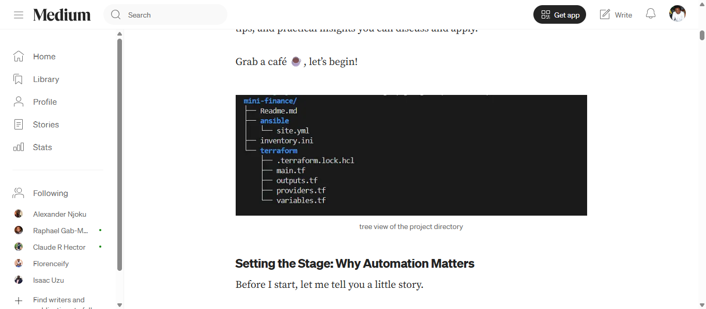

# This project is for practice only
This is just a practice repo, where we learn Git and GitHub.

## Features
- Login Page
- About Page
- Contact Page

## Demo
We demonstrate the usage of Git commands, and syntaxes.

## Installation
### Install Node.js
```
npm install express
npm run dev
npm build
```
**Contributing**
*Only members of this project group are elegible to contribute*

***Be specific with your Pull Request!***

`sudo apt update && sudo apt upgrade`

~~Onclick~~

## Nubering
1. Clone repo
2. Install packages
3. Run project

## Dependecies
- Backend
  - Node.js
  - Express
- Frondend
  - React
  - Vue

## Our Website
[visit our website] (https://peabsmartacademy.com/)

## Dashboard Image


*Figure 1. Dashboard Image*


*Figure 2. Dashboard Image*

## Table
|Name|Role|Task|
|----|-----|----|
|John|Backend|API|
|Mark|Frontend|Login-page|
|Alex|DevOps|CI/CD|

---


- [x] Login System
- [x] Dashboard
- [ ] Notifications


<div align="center">
  <h1>Major Title</h1>
  <p>Best app for productivity</p>
</div>


